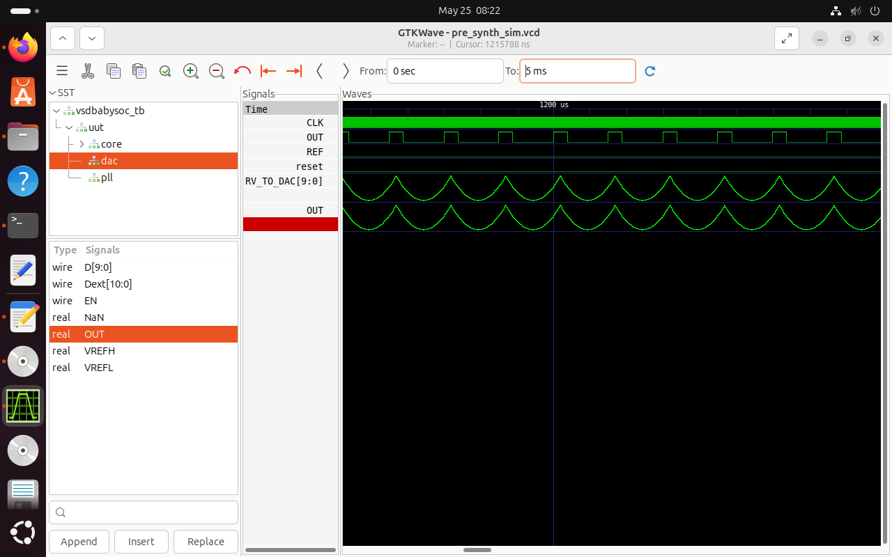

# VSDBabySoC — Pre-Synthesis Simulation

A mixed-signal SoC integrating a RISC-V CPU (RVMYTH), PLL, and 10-bit DAC,
simulated using iverilog and GTKWave on Sky130 PDK.

## What I built and verified

The VSDBabySoC consists of three blocks:
- **RVMYTH** — Pipelined RISC-V RV32I CPU core (from MYTH workshop)
- **AVSD PLL** — Generates stable CPU clock from 12MHz reference
- **AVSD DAC** — 10-bit digital-to-analog converter (R-2R based)

Signal flow:
REF (12MHz) → PLL → CLK → RVMYTH CPU → RV_TO_DAC[9:0] → DAC → OUT (analog)

## Bug I found and fixed

The original testbench had a timing bug:
- PLL was enabled **after** reset was asserted
- CLK was X (unknown) during CPU startup
- CPU never executed — RV_TO_DAC stayed X

**Fix:** Enable PLL first, wait 900ns for clock stabilization, then assert reset.

## Simulation result



- `RV_TO_DAC[9:0]` — CPU produces triangular digital pattern (0→43→0)
- `OUT` — DAC converts to analog voltage triangular wave
- Full SoC verified at behavioral level

## How to run

```bash
chmod +x run_sim.sh
./run_sim.sh
gtkwave output/pre_synth_sim/pre_synth_sim.vcd
```

## Tools used
- iverilog 12.0
- GTKWave 3.3.116
- Sky130 PDK
- ngspice 37, Magic 8.3, Xschem 3.4.4

## Part of
VSD AI-Assisted Analog & Mixed-Signal VLSI Internship — June 2026
